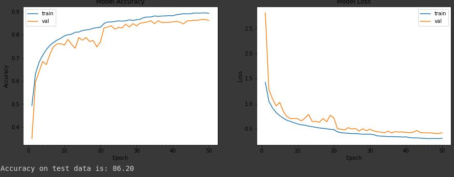

<b>1. Final Validation accuracy for Base Network</b>
0.8606

<b> 2. Your model definition (model.add... ) with output channel size and receptive field </b>
model = Sequential()

model.add(SeparableConv2D(32, kernel_size=(3,3), activation='relu', padding='same', input_shape=(32,32,3))) #32,32,32  |  3x3 
model.add(BatchNormalization()) 
model.add(Dropout(0.1)) 
model.add(SeparableConv2D(64, kernel_size=(3,3), activation='relu', padding='same')) #32,32,64  |  5x5  
model.add(BatchNormalization()) 
model.add(Dropout(0.1)) 
 
model.add(MaxPooling2D(2,2))  #16, 16, 64  | 6x6  
 
model.add(Convolution2D(32, 1,1, activation='relu', border_mode='same')) #16, 16, 32  |  6x6 
model.add(BatchNormalization()) 
model.add(Dropout(0.1)) 
 
model.add(SeparableConv2D(64, kernel_size=(3,3), activation='relu', padding='same')) #16, 16, 64  | 10x10 
model.add(BatchNormalization())  
model.add(Dropout(0.1))  
model.add(SeparableConv2D(128, kernel_size=(3,3), activation='relu', padding='same')) #16, 16, 128  |  14x14 
model.add(BatchNormalization()) 
model.add(Dropout(0.1)) 
 
model.add(MaxPooling2D(2,2))  #8,8,128  | 16x16

model.add(Convolution2D(64, 1,1, activation='relu', border_mode='same')) #8,8,64  |  16x16
model.add(BatchNormalization())
model.add(Dropout(0.1))

model.add(SeparableConv2D(128, kernel_size=(3,3), activation='relu', padding='same')) # 8,8,128  |  24x24
model.add(BatchNormalization())
model.add(Dropout(0.1))
model.add(SeparableConv2D(256, kernel_size=(3,3), activation='relu', padding='same')) #8,8,256  |  32x32
model.add(BatchNormalization())
model.add(Dropout(0.5))

model.add(Convolution2D(num_classes, 1, activation='relu', padding='same')) #8,8,10
model.add(BatchNormalization())

model.add(GlobalAveragePooling2D()) #1,1,10

model.add(Activation('softmax'))

<b>Your 50 epoch logs </b>  
Epoch 1/50
390/390 [==============================] - 32s 82ms/step - loss: 1.4049 - acc: 0.5000 - val_loss: 1.7713 - val_acc: 0.4984

Epoch 00001: val_acc improved from -inf to 0.49840, saving model to model/weights.hdf5
Epoch 2/50
390/390 [==============================] - 25s 65ms/step - loss: 1.0502 - acc: 0.6310 - val_loss: 1.3823 - val_acc: 0.5568

Epoch 00002: val_acc improved from 0.49840 to 0.55680, saving model to model/weights.hdf5
Epoch 3/50
390/390 [==============================] - 25s 65ms/step - loss: 0.9281 - acc: 0.6752 - val_loss: 1.1499 - val_acc: 0.6115

Epoch 00003: val_acc improved from 0.55680 to 0.61150, saving model to model/weights.hdf5
Epoch 4/50
390/390 [==============================] - 25s 65ms/step - loss: 0.8381 - acc: 0.7060 - val_loss: 0.9409 - val_acc: 0.6870

Epoch 00004: val_acc improved from 0.61150 to 0.68700, saving model to model/weights.hdf5
Epoch 5/50
390/390 [==============================] - 25s 65ms/step - loss: 0.7797 - acc: 0.7282 - val_loss: 1.1157 - val_acc: 0.6551

Epoch 00005: val_acc did not improve from 0.68700
Epoch 6/50
390/390 [==============================] - 25s 65ms/step - loss: 0.7294 - acc: 0.7492 - val_loss: 0.8373 - val_acc: 0.7091

Epoch 00006: val_acc improved from 0.68700 to 0.70910, saving model to model/weights.hdf5
Epoch 7/50
390/390 [==============================] - 25s 65ms/step - loss: 0.6821 - acc: 0.7608 - val_loss: 0.7337 - val_acc: 0.7537

Epoch 00007: val_acc improved from 0.70910 to 0.75370, saving model to model/weights.hdf5
Epoch 8/50
390/390 [==============================] - 25s 65ms/step - loss: 0.6522 - acc: 0.7740 - val_loss: 0.9745 - val_acc: 0.6814

Epoch 00008: val_acc did not improve from 0.75370
Epoch 9/50
390/390 [==============================] - 25s 65ms/step - loss: 0.6246 - acc: 0.7835 - val_loss: 0.6806 - val_acc: 0.7658

Epoch 00009: val_acc improved from 0.75370 to 0.76580, saving model to model/weights.hdf5
Epoch 10/50
390/390 [==============================] - 25s 65ms/step - loss: 0.6009 - acc: 0.7899 - val_loss: 1.0100 - val_acc: 0.6722

Epoch 00010: val_acc did not improve from 0.76580
Epoch 11/50
390/390 [==============================] - 25s 65ms/step - loss: 0.5836 - acc: 0.7973 - val_loss: 0.6289 - val_acc: 0.7823

Epoch 00011: val_acc improved from 0.76580 to 0.78230, saving model to model/weights.hdf5
Epoch 12/50
390/390 [==============================] - 25s 65ms/step - loss: 0.5719 - acc: 0.8011 - val_loss: 0.6798 - val_acc: 0.7719

Epoch 00012: val_acc did not improve from 0.78230
Epoch 13/50
390/390 [==============================] - 25s 65ms/step - loss: 0.5577 - acc: 0.8081 - val_loss: 1.0354 - val_acc: 0.6867

Epoch 00013: val_acc did not improve from 0.78230
Epoch 14/50
390/390 [==============================] - 25s 65ms/step - loss: 0.5445 - acc: 0.8096 - val_loss: 0.7552 - val_acc: 0.7577

Epoch 00014: val_acc did not improve from 0.78230
Epoch 15/50
390/390 [==============================] - 25s 65ms/step - loss: 0.5272 - acc: 0.8175 - val_loss: 0.5571 - val_acc: 0.8102

Epoch 00015: val_acc improved from 0.78230 to 0.81020, saving model to model/weights.hdf5
Epoch 16/50
390/390 [==============================] - 25s 65ms/step - loss: 0.5191 - acc: 0.8199 - val_loss: 0.6515 - val_acc: 0.7833

Epoch 00016: val_acc did not improve from 0.81020
Epoch 17/50
390/390 [==============================] - 25s 65ms/step - loss: 0.5096 - acc: 0.8214 - val_loss: 0.7230 - val_acc: 0.7565

Epoch 00017: val_acc did not improve from 0.81020
Epoch 18/50
390/390 [==============================] - 25s 65ms/step - loss: 0.4965 - acc: 0.8259 - val_loss: 0.6776 - val_acc: 0.7691

Epoch 00018: val_acc did not improve from 0.81020
Epoch 19/50
390/390 [==============================] - 25s 65ms/step - loss: 0.4899 - acc: 0.8285 - val_loss: 0.5275 - val_acc: 0.8188

Epoch 00019: val_acc improved from 0.81020 to 0.81880, saving model to model/weights.hdf5
Epoch 20/50
390/390 [==============================] - 25s 65ms/step - loss: 0.4803 - acc: 0.8301 - val_loss: 0.7461 - val_acc: 0.7454

Epoch 00020: val_acc did not improve from 0.81880
Epoch 21/50
390/390 [==============================] - 25s 65ms/step - loss: 0.4678 - acc: 0.8375 - val_loss: 0.5612 - val_acc: 0.8098

Epoch 00021: val_acc did not improve from 0.81880
Epoch 22/50
390/390 [==============================] - 25s 65ms/step - loss: 0.4693 - acc: 0.8363 - val_loss: 0.5775 - val_acc: 0.8066

Epoch 00022: val_acc did not improve from 0.81880
Epoch 23/50
390/390 [==============================] - 25s 65ms/step - loss: 0.4545 - acc: 0.8411 - val_loss: 0.5373 - val_acc: 0.8192

Epoch 00023: ReduceLROnPlateau reducing learning rate to 0.004999999888241291.

Epoch 00023: val_acc improved from 0.81880 to 0.81920, saving model to model/weights.hdf5
Epoch 24/50
390/390 [==============================] - 25s 65ms/step - loss: 0.4130 - acc: 0.8562 - val_loss: 0.4705 - val_acc: 0.8393

Epoch 00024: val_acc improved from 0.81920 to 0.83930, saving model to model/weights.hdf5
Epoch 25/50
390/390 [==============================] - 25s 65ms/step - loss: 0.3989 - acc: 0.8602 - val_loss: 0.5142 - val_acc: 0.8273

Epoch 00025: val_acc did not improve from 0.83930
Epoch 26/50
390/390 [==============================] - 25s 65ms/step - loss: 0.3914 - acc: 0.8628 - val_loss: 0.4888 - val_acc: 0.8357

Epoch 00026: val_acc did not improve from 0.83930
Epoch 27/50
390/390 [==============================] - 25s 65ms/step - loss: 0.3907 - acc: 0.8625 - val_loss: 0.5234 - val_acc: 0.8279

Epoch 00027: val_acc did not improve from 0.83930
Epoch 28/50
390/390 [==============================] - 25s 65ms/step - loss: 0.3857 - acc: 0.8640 - val_loss: 0.5182 - val_acc: 0.8254

Epoch 00028: ReduceLROnPlateau reducing learning rate to 0.0024999999441206455.

Epoch 00028: val_acc did not improve from 0.83930
Epoch 29/50
390/390 [==============================] - 25s 65ms/step - loss: 0.3588 - acc: 0.8752 - val_loss: 0.4460 - val_acc: 0.8506

Epoch 00029: val_acc improved from 0.83930 to 0.85060, saving model to model/weights.hdf5
Epoch 30/50
390/390 [==============================] - 25s 65ms/step - loss: 0.3512 - acc: 0.8771 - val_loss: 0.4391 - val_acc: 0.8499

Epoch 00030: val_acc did not improve from 0.85060
Epoch 31/50
390/390 [==============================] - 25s 64ms/step - loss: 0.3510 - acc: 0.8773 - val_loss: 0.4573 - val_acc: 0.8440

Epoch 00031: val_acc did not improve from 0.85060
Epoch 32/50
390/390 [==============================] - 25s 65ms/step - loss: 0.3434 - acc: 0.8792 - val_loss: 0.4656 - val_acc: 0.8446

Epoch 00032: val_acc did not improve from 0.85060
Epoch 33/50
390/390 [==============================] - 25s 65ms/step - loss: 0.3401 - acc: 0.8810 - val_loss: 0.4382 - val_acc: 0.8523

Epoch 00033: val_acc improved from 0.85060 to 0.85230, saving model to model/weights.hdf5
Epoch 34/50
390/390 [==============================] - 25s 65ms/step - loss: 0.3395 - acc: 0.8799 - val_loss: 0.4290 - val_acc: 0.8522

Epoch 00034: val_acc did not improve from 0.85230
Epoch 35/50
390/390 [==============================] - 25s 65ms/step - loss: 0.3410 - acc: 0.8799 - val_loss: 0.4453 - val_acc: 0.8480

Epoch 00035: val_acc did not improve from 0.85230
Epoch 36/50
390/390 [==============================] - 25s 65ms/step - loss: 0.3324 - acc: 0.8833 - val_loss: 0.4559 - val_acc: 0.8496

Epoch 00036: val_acc did not improve from 0.85230
Epoch 37/50
390/390 [==============================] - 25s 65ms/step - loss: 0.3349 - acc: 0.8822 - val_loss: 0.4420 - val_acc: 0.8521

Epoch 00037: val_acc did not improve from 0.85230
Epoch 38/50
390/390 [==============================] - 25s 65ms/step - loss: 0.3355 - acc: 0.8811 - val_loss: 0.4502 - val_acc: 0.8517

Epoch 00038: ReduceLROnPlateau reducing learning rate to 0.0012499999720603228.

Epoch 00038: val_acc did not improve from 0.85230
Epoch 39/50
390/390 [==============================] - 25s 65ms/step - loss: 0.3225 - acc: 0.8857 - val_loss: 0.4188 - val_acc: 0.8584

Epoch 00039: val_acc improved from 0.85230 to 0.85840, saving model to model/weights.hdf5
Epoch 40/50
390/390 [==============================] - 25s 65ms/step - loss: 0.3139 - acc: 0.8901 - val_loss: 0.4204 - val_acc: 0.8580

Epoch 00040: val_acc did not improve from 0.85840
Epoch 41/50
390/390 [==============================] - 25s 65ms/step - loss: 0.3100 - acc: 0.8911 - val_loss: 0.4130 - val_acc: 0.8581

Epoch 00041: val_acc did not improve from 0.85840
Epoch 42/50
390/390 [==============================] - 25s 65ms/step - loss: 0.3118 - acc: 0.8903 - val_loss: 0.4309 - val_acc: 0.8558

Epoch 00042: val_acc did not improve from 0.85840
Epoch 43/50
390/390 [==============================] - 25s 65ms/step - loss: 0.3066 - acc: 0.8923 - val_loss: 0.4186 - val_acc: 0.8590

Epoch 00043: val_acc improved from 0.85840 to 0.85900, saving model to model/weights.hdf5
Epoch 44/50
390/390 [==============================] - 25s 65ms/step - loss: 0.3105 - acc: 0.8905 - val_loss: 0.4129 - val_acc: 0.8606

Epoch 00044: val_acc improved from 0.85900 to 0.86060, saving model to model/weights.hdf5
Epoch 45/50
390/390 [==============================] - 25s 65ms/step - loss: 0.3094 - acc: 0.8909 - val_loss: 0.4325 - val_acc: 0.8537

Epoch 00045: val_acc did not improve from 0.86060
Epoch 46/50
390/390 [==============================] - 25s 65ms/step - loss: 0.3043 - acc: 0.8937 - val_loss: 0.4197 - val_acc: 0.8600

Epoch 00046: val_acc did not improve from 0.86060
Epoch 47/50
390/390 [==============================] - 25s 65ms/step - loss: 0.3056 - acc: 0.8922 - val_loss: 0.4391 - val_acc: 0.8527

Epoch 00047: val_acc did not improve from 0.86060
Epoch 48/50
390/390 [==============================] - 25s 65ms/step - loss: 0.3024 - acc: 0.8930 - val_loss: 0.4262 - val_acc: 0.8564

Epoch 00048: ReduceLROnPlateau reducing learning rate to 0.0006249999860301614.

Epoch 00048: val_acc did not improve from 0.86060
Epoch 49/50
390/390 [==============================] - 25s 65ms/step - loss: 0.2972 - acc: 0.8959 - val_loss: 0.4255 - val_acc: 0.8595

Epoch 00049: val_acc did not improve from 0.86060
Epoch 50/50
390/390 [==============================] - 25s 65ms/step - loss: 0.2950 - acc: 0.8960 - val_loss: 0.4174 - val_acc: 0.8581

+Aug
acc: 0.8945 - val_acc: 0.8660

